# 算法笔记

## 1.新手

1.1 打印32位(Integer.MAX_VALUE为2^31-1,首位为符号位)

```java
package practice.begin;

/**
 * @User: layman
 * @Date: 2021/12/29 9:41
 * @Description:
 */
public class Code01_PrintB {
    public static void main(String[] args) {
        ////32位 00000101000000001010010100001000
        //int num = 83928328;
        //32位 00000000000000000000000000000001
        int num = 1;
        print(num);
        //01111111111111111111111111111111
        //无符号的范围0~2^32-1      2^32个
        //有符号的范围-2^31~2^31-1  2^32个
        int max = Integer.MAX_VALUE;
        print(max);
        //11111111111111111111111111111111
        //~x+1
        //int fushu=-1;
        //print(fushu);
        //10000000000000000000000000000000
        int min = Integer.MIN_VALUE;
        print(min);
        int a = 123;
        int b = ~a;
        //00000000000000000000000001111011
        //11111111111111111111111110000100
        //print(a);
        //print(b);
        int c = 12334242;
        int d = 42342432;
        //00000000101111000011010010100010
        //00000010100001100001100000100000
        //00000010101111100011110010100010
        //00000000100001000001000000100000
        //00000010001110100010110010000010
        print(c);
        print(d);
        print(c | d);
        print(c & d);
        print(c ^ d);
        //11000000000000000000000000000000
        //01000000000000000000000000000000
        print(min >> 1);//带符号右移,符号补
        print(min >>> 1);//不带符号右移,0补

    }

    private static void print(int num) {
        for (int i = 31; i >= 0; i--) {
            System.out.print((num & (1 << i)) == 0 ? "0" : "1");
        }
        System.out.println();
    }
}

```

1.2 选择排序

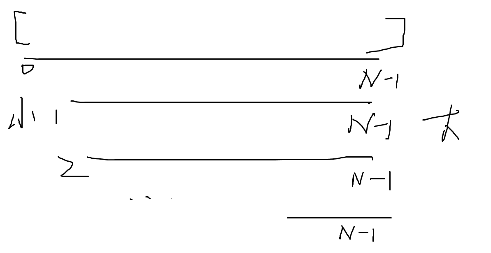

1.3 冒泡排序

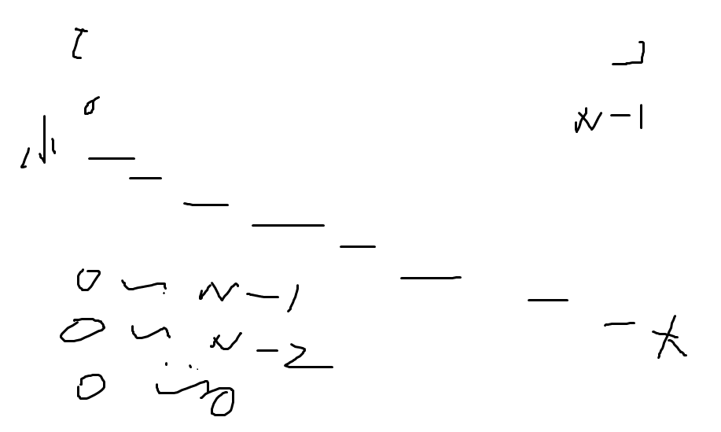

1. 4 插入排序

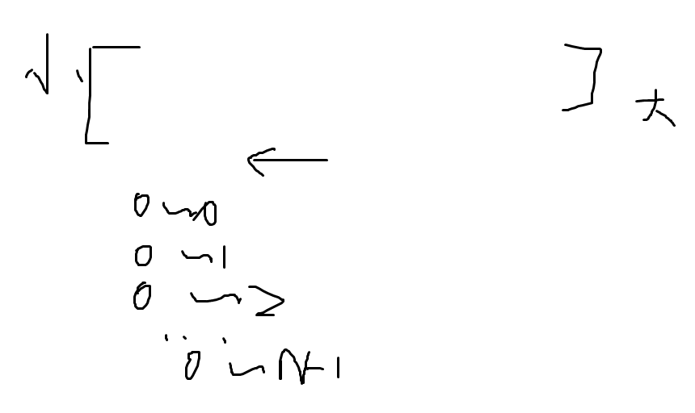

tips:  `x*2-> x<<1  x+1 -> x|1`

最右侧的1`N&((~N)+1)` 抹掉最右侧的1`N^=rightOne`

1.5 递归复杂度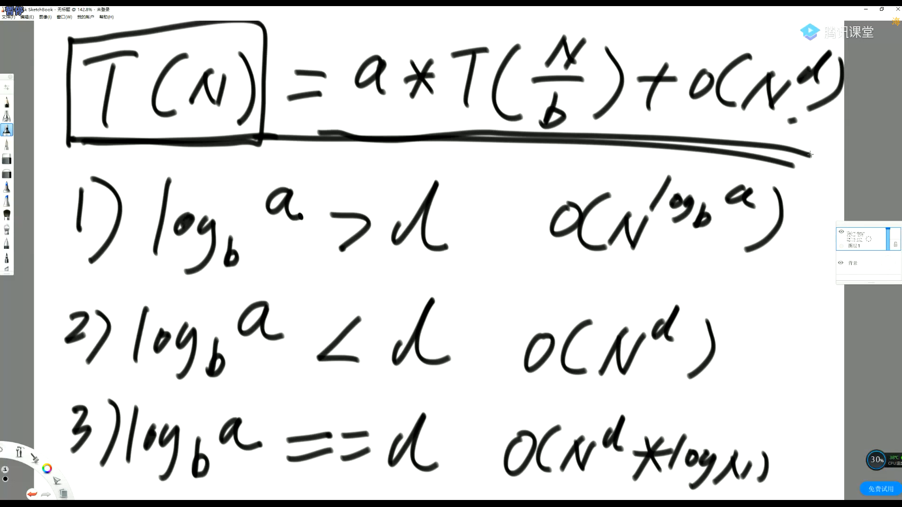

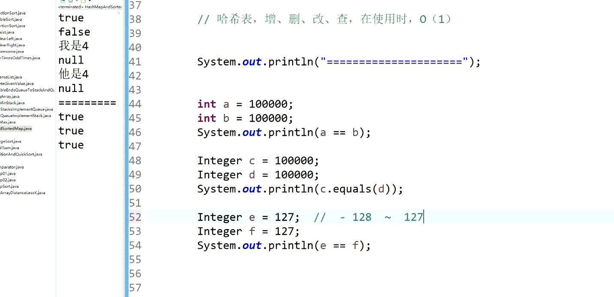

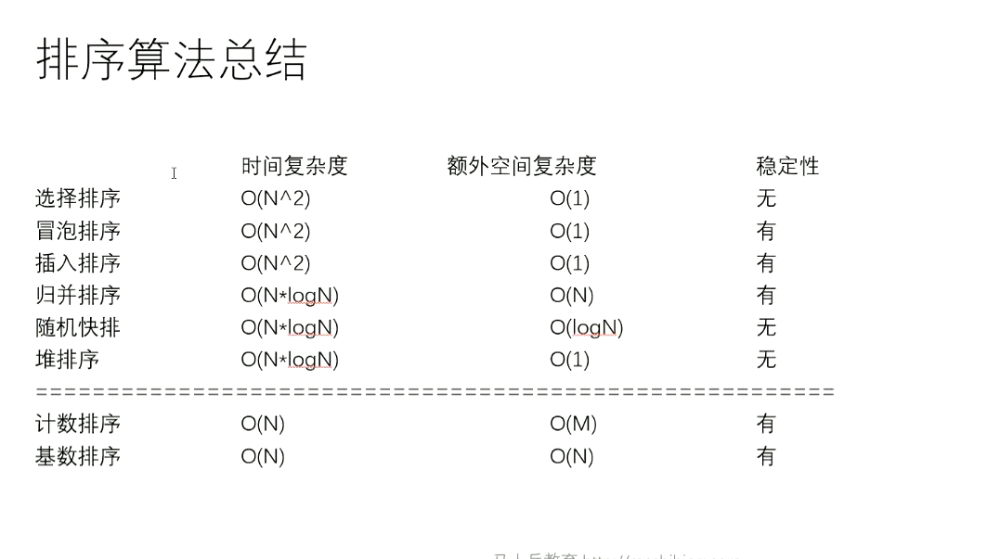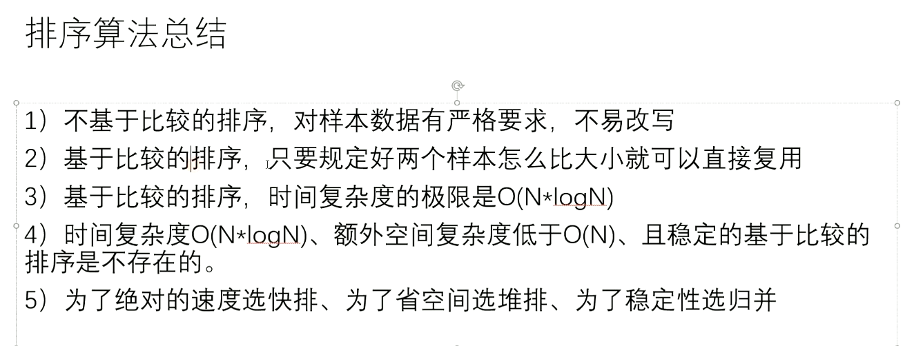

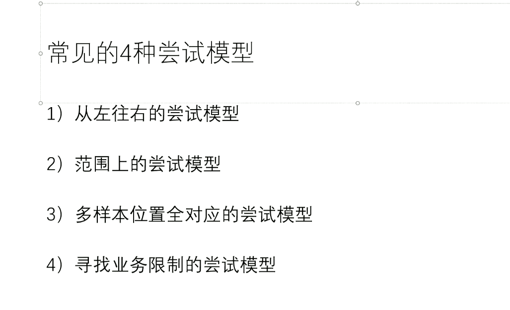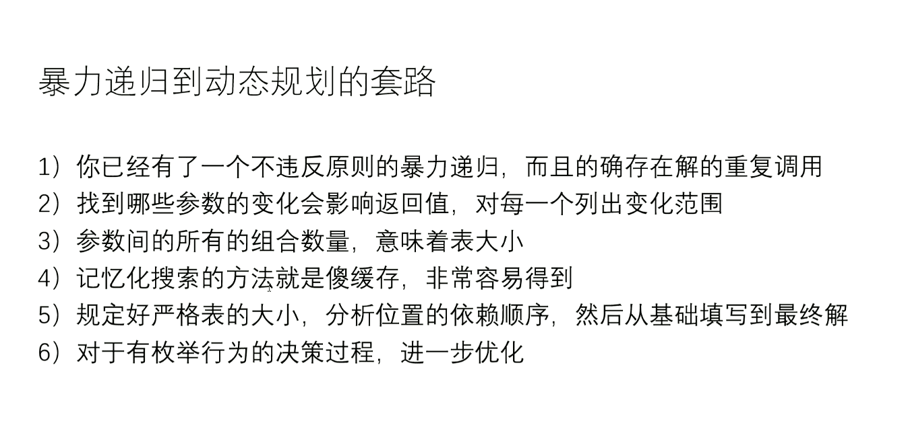

`LinkedList 双端队列`

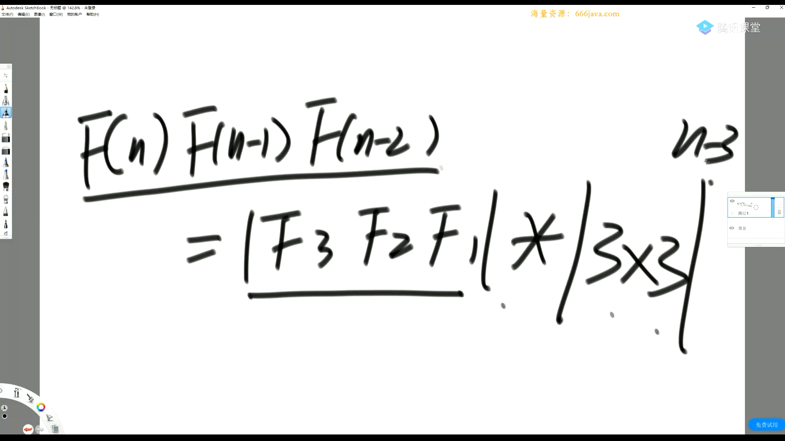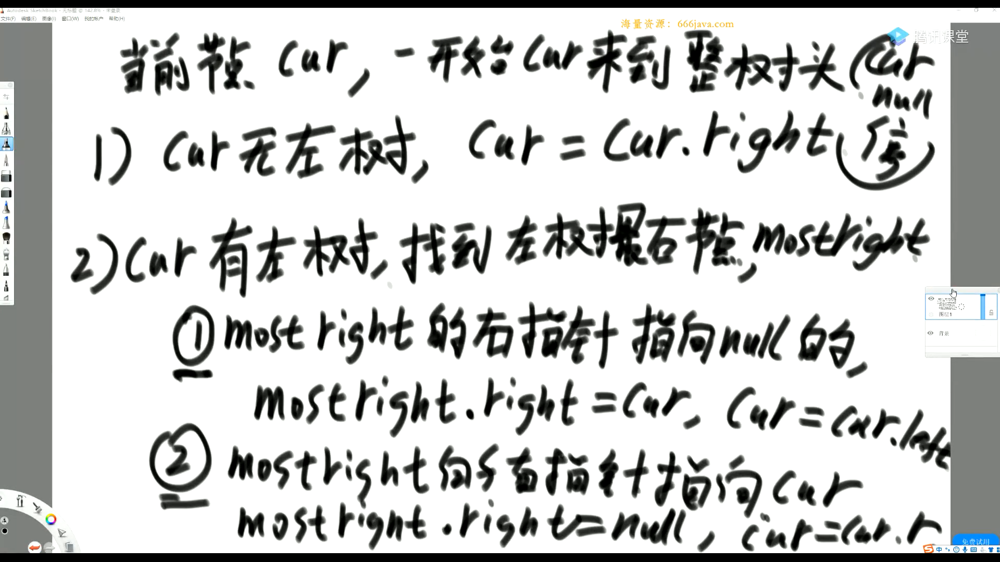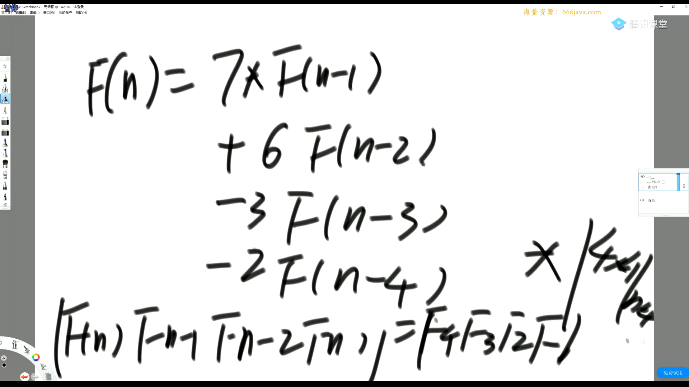2.基础

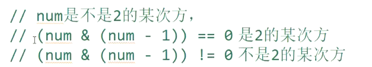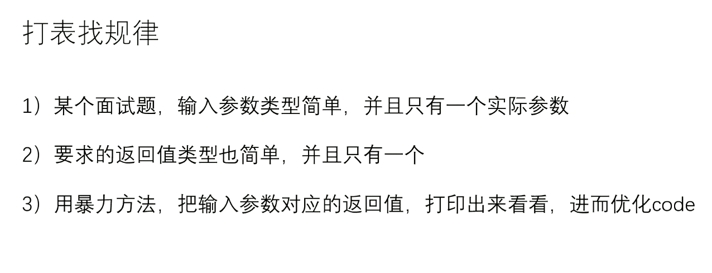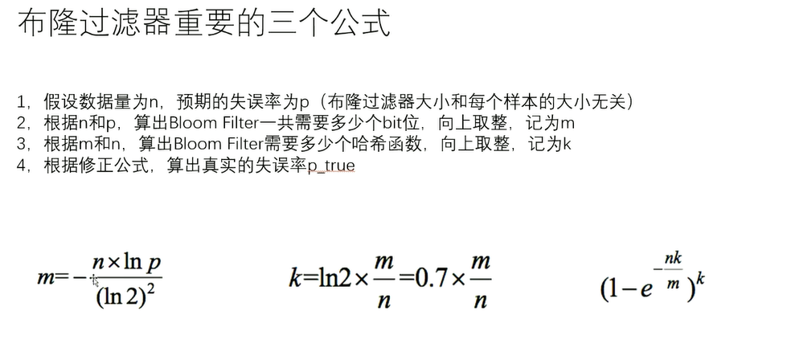

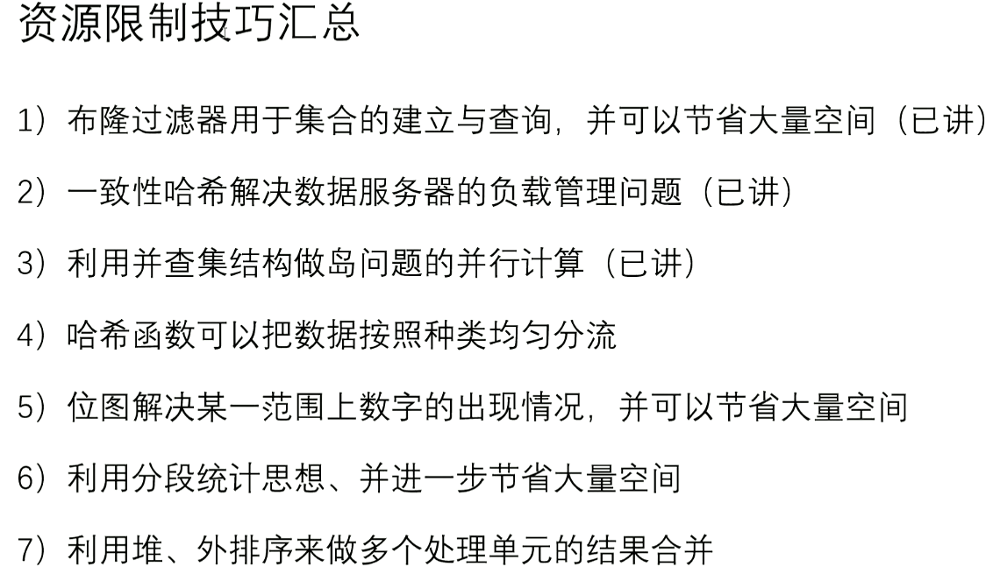

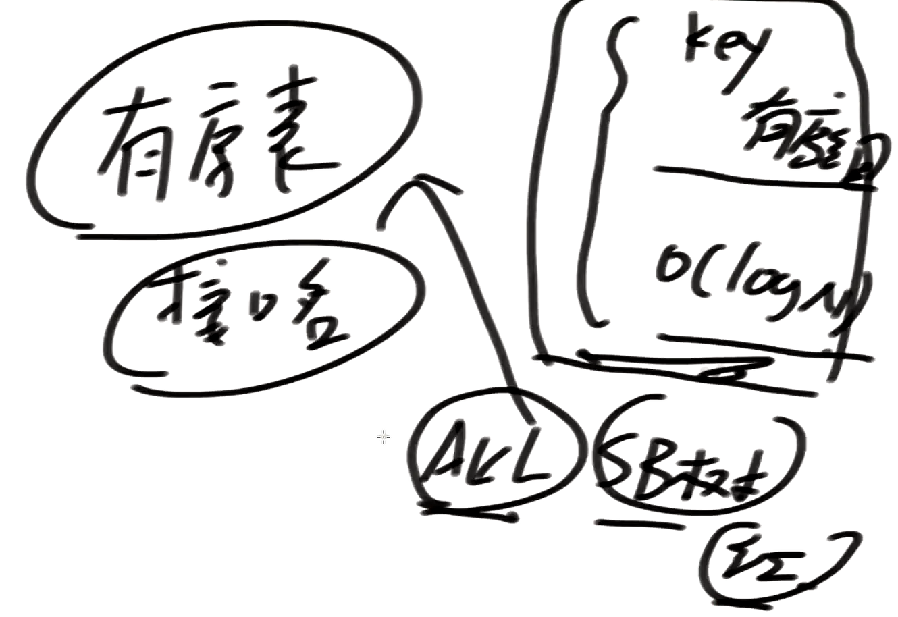

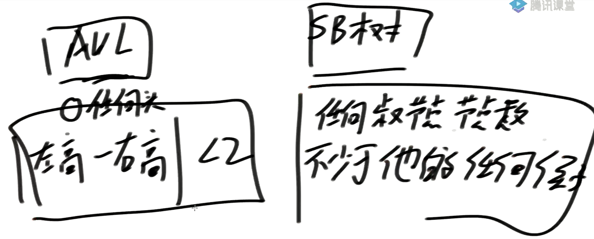

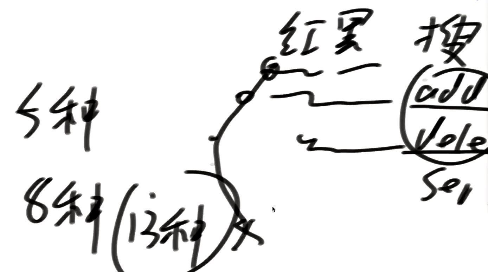

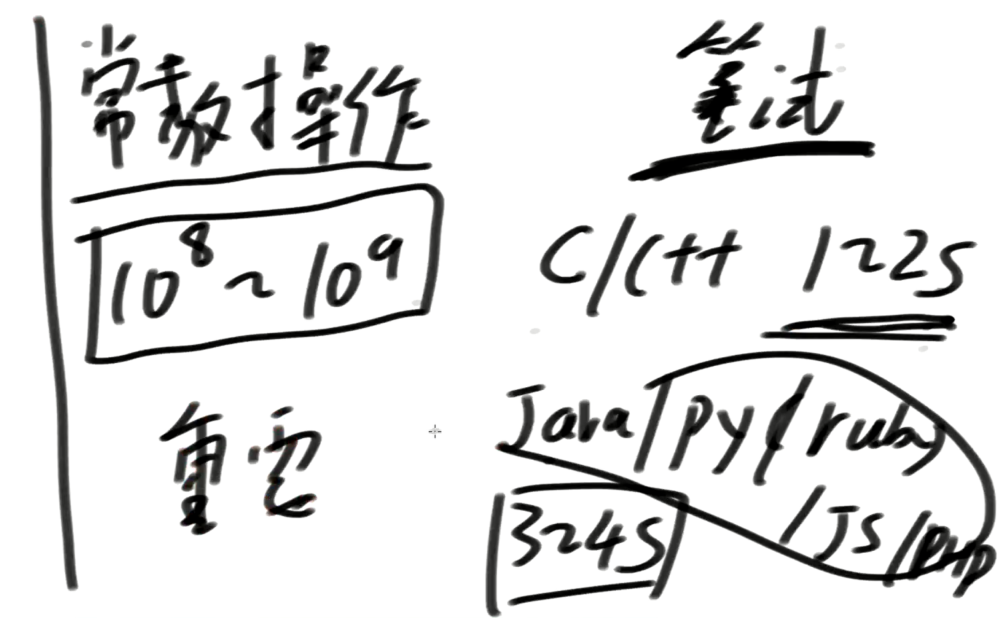       

## 3.进阶